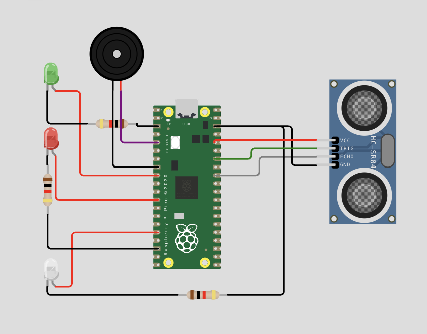
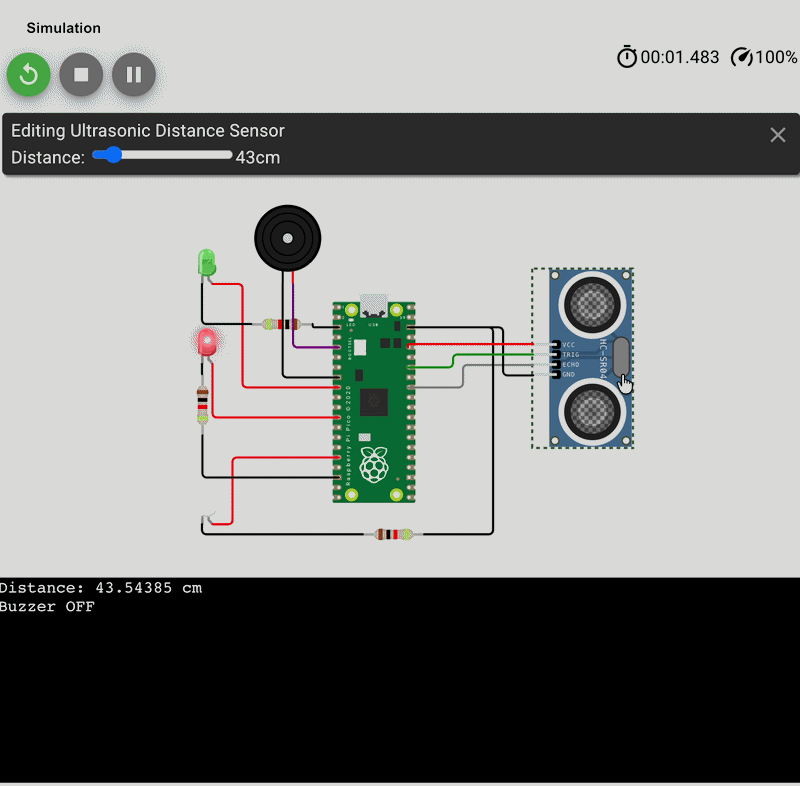

# Raspberry Pi Follow Me LEDs

## Description

This is a distance detector made using a HC-SR04 ultrasonic sensor via microcontroller Raspberry Pi Pico. It contains an ultrasonic sensor, buzzer, red, green and white LED. The Trigger pin is the output connected to the GPIO pin, with the echo being the input and connected to another GPIO pin. They are defined in the code. It is powered by the 3v and ground goes to ground.

For the LEDs the anode is connected to a GPIO pinout, and the cathode is connected to resistor and to ground. There are three types of LED, the red being too far, the green being close, and the white is passively on. The white LED indicates activity, so powered on. For the buzzer, it is connect to GPIO pinout and is grounded.

When the ultrasonic detects something less than 20 cm away, the LED turns green. If the value is greater than 20cm, the sensor will turn to the red LED. This also affects the buzzer resulting in a 1000 Hz Frequency noise.

I made this because I wanted to make some sort of simple object or spatial detector with a buzzer that indicates the detection. A lot of the code I copied and combined to one document in my one project.

## Demo

## Link to Simulation

![Link to simulation][https://wokwi.com/projects/462061522885639169]